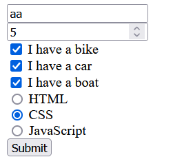

# Form block
## Description
This block is used to display a form. It is useful for getting user input. This block automatically generates a click handler for the submit button that sends the form data to the server. The form data is sent as a JSON object with the following format:
```js
{
    "form_name1":  "form_value1", // string input
    "form_name2":  123, // number input
    "form_name3":  [v1, v2, ...] // checkbox input
    "form_name3":  v1 // radio input
}
```

## Requirements
This block requires the following libraries:
- form.js

```html
<script src="/static/lib/form.js"></script>
```

## Configuration
```js
{
    target: some_URL,
    callback: some_function,
}
```
- `target`: the URL to send the form data to, like `/api/some_endpoint`
- `callback`: an additional function to call when the form is submitted

## Actions
the form object does not take in any actions

## Example
This example is also available as a demo
```html
<form id="myForm">
    <input type="text" name="name" placeholder="Name"><br>
    <input type="number" name="age" placeholder="Age"><br>

    <!-- checkboxes -->
    <input type="checkbox" id="vehicle1" name="vehicles" value="Bike">
    <label for="vehicle1"> I have a bike</label><br>
    <input type="checkbox" id="vehicle2" name="vehicles" value="Car">
    <label for="vehicle2"> I have a car</label><br>
    <input type="checkbox" id="vehicle3" name="vehicles" value="Boat">
    <label for="vehicle3"> I have a boat</label><br> 

    <!-- radio buttons -->
    <input type="radio" id="html" name="fav_language" value="HTML">
    <label for="html">HTML</label><br>
    <input type="radio" id="css" name="fav_language" value="CSS">
    <label for="css">CSS</label><br>
    <input type="radio" id="javascript" name="fav_language" value="JavaScript">
    <label for="javascript">JavaScript</label> <br>


    <input type="submit" value="Submit">
</form>
```

### Result
