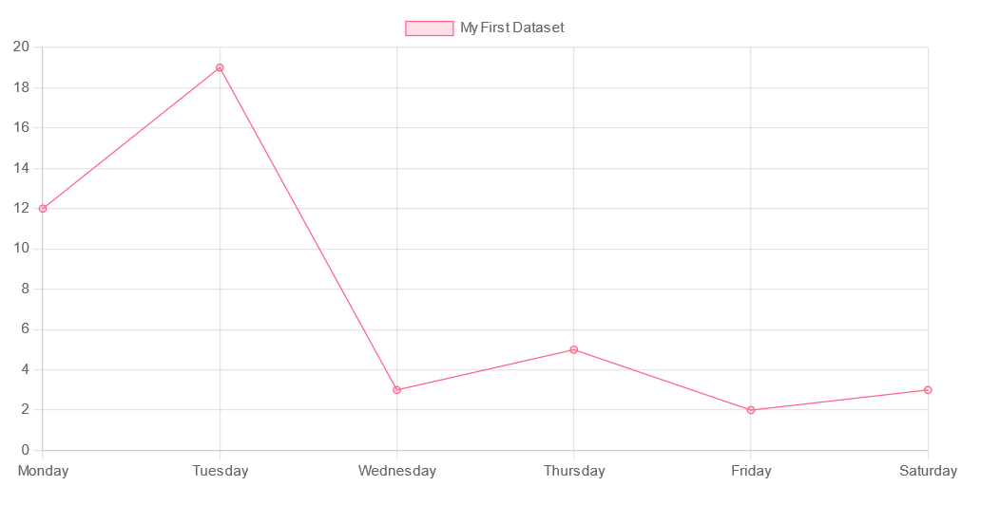

# Line chart block
## Description
This block is used to display data in a line chart. useful for categorical data.
## Requirements
This block requires the following libraries:
- chart.js
- linechart.js

```html	
<script src="/static/lib/chart.js"></script>
<script src="/static/lib/linechart.js"></script>
```

## Configuration
```js
{
    data: {...}
    options: {...}
}
```

`data`: the data to display in the chart, in the format specified by [chart.js](https://www.chartjs.org/docs/latest/charts/line.html)

`options`: the options to use for the chart, in the format specified by [chart.js](https://www.chartjs.org/docs/latest/charts/line.html#dataset-properties).

## Actions
### set
```python
{
    "action": "set",
    "series": "series_name", # optional
    "value": [category, value]
}
```

sets the value for a specific category. If no series is specified, the data will be set for the first series.

### add
```python
{
    "action": "add",
    "series": "series_name", # optional
    "value": [category, value]
}
```

Adds the value to the current value for a specific category. If no series is specified, the data will be added for the first series.

### reset
```python
{
    "action": "reset",
    "series": "series_name" # optional
}
```

Resets the data for the specified series to the initial value specified in the data config (if given). If no series is specified, the data will be reset for all series.

## Example
This example is also available as a demo
```html
<div style="height: 400px; overflow: hidden">
    <canvas id="myChart"></canvas>
</div>

<script>
    let chart = linechart('myChart', {
        data: {
            labels: ['Monday', 'Tuesday', 'Wednesday', 'Thursday', 'Friday', 'Saturday'],
            datasets: [{
                label: 'My First Dataset',
                data: [12, 19, 3, 5, 2, 3],
                backgroundColor: [
                    'rgba(255, 99, 132, 0.2)',
                ],
                borderColor: [
                    'rgba(255, 99, 132, 1)',
                ],
                borderWidth: 1
            }]
        },
        options: {
            scales: {
                y: {
                    beginAtZero: true
                }
            },
            responsive: true,
        }
    });
    
    connect_block(chart, 'linechart')
</script>
```

```
emit("linechart", {
    "action": "set",
    "value": ["Red", 10]
})

emit("linechart", {
    "action": "add",
    "value": ["Blue", 20]
})
```


### Result

