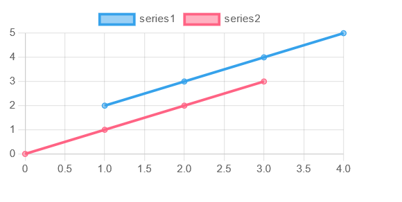

# Linear chart block
## Description
This block displays a linear line chart (or scatter plot) of the data it receives. It is useful for displaying data over time, or other linear data.
or any other data that can be represented as a line chart.

## Requirements
This block requires the following libraries:
- chart.js
- linechart.js

```html	
<script src="/static/lib/chart.js"></script>
<script src="/static/lib/linearchart.js"></script>
```

## Configuration
```js
{
    data: {...}
    options: {...}
}
```
`data`: the data to display in the chart, in the format specified by [chart.js](https://www.chartjs.org/docs/latest/charts/scatter.html)

`data.datasets[].memory`: if the amount of data is larger than the `memory` value, the oldest data will be removed from the chart.

`options`: the options to use for the chart, in the format specified by [chart.js](https://www.chartjs.org/docs/latest/charts/line.html#dataset-properties).


> **Note:** This block changes the default setting of `showLines` to `true`.

## Actions
### set
```python
{
    "action": "set",
    "series": "series_name", # optional
    "value": [[x1, y1], [x2, y2], ...]
}
```

Sets the data for the specified series. If no series is specified, the data will be set for the first series.

### add
```python
{
    "action": "add",
    "series": "series_name", # optional
    "value": [x1, y1]
}
```

Adds a data point to the specified series. If no series is specified, the data will be added to the first series.

### reset
```python
{
    "action": "reset",
    "series": "series_name" # optional
}
```

Resets the data for the specified series to the initial value specified in the data config (if given). If no series is specified, the data will be reset for all series.

## Example
This example is also available as a demo

```html	
<div>
    <canvas id="chart" width="400" height="400"></canvas>
</div>

<script>
    var chart = linearchart('chart', {
        data: {
            datasets: [{
                label: 'series1',
                data: [],
                memory: 100
            }, {
                label: 'series2',
                data: [[0, 0], [1, 1], [2, 2], [3, 3]],
                memory: 100
            }]
        },
        options: {
            scales: {
                xAxes: [{
                    type: 'linear',
                    position: 'bottom'
                }]
            }
        }
    });
    connect_block(chart, 'chart');
</script>
```

```python
emit('chart', {
    'action': 'set',
    'series': 'series1',
    'value': [[1, 2], [2, 3], [3, 4]]
})

emit('chart', {
    'action': 'add',
    'series': 'series1',
    'value': [4, 5]
})
```

### Output
